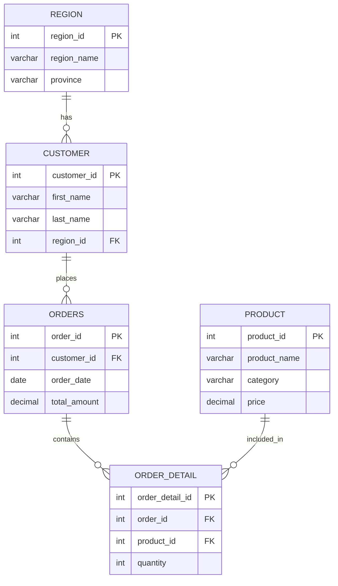
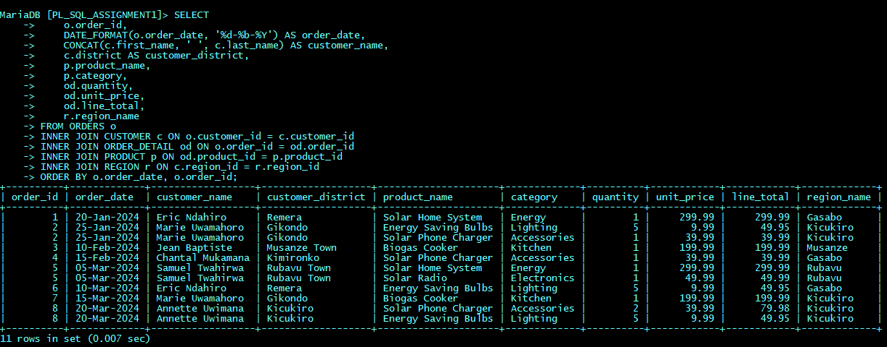
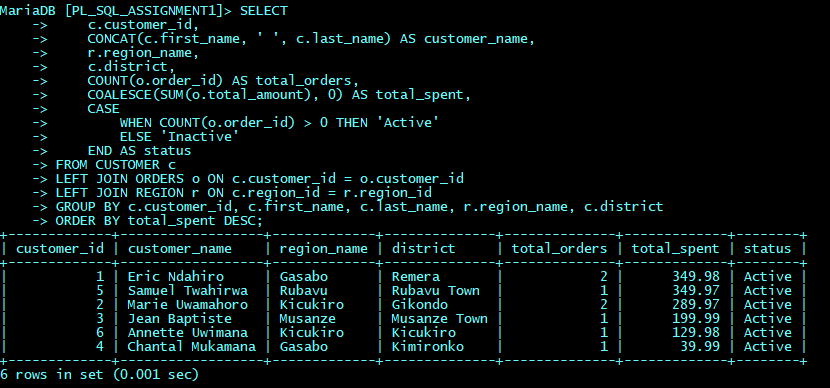
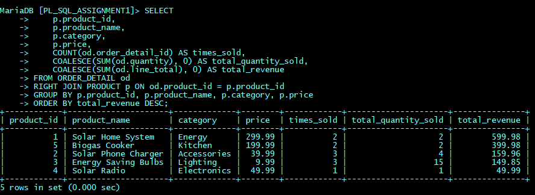
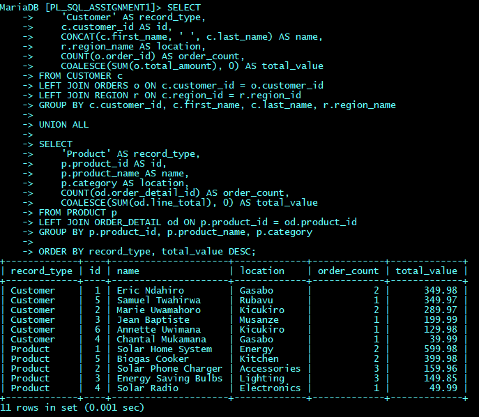
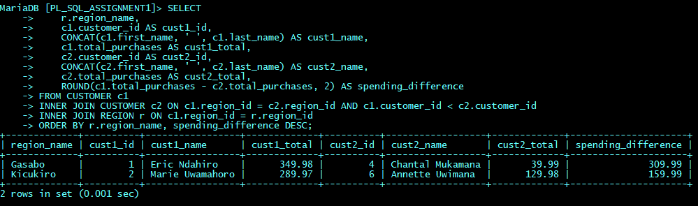
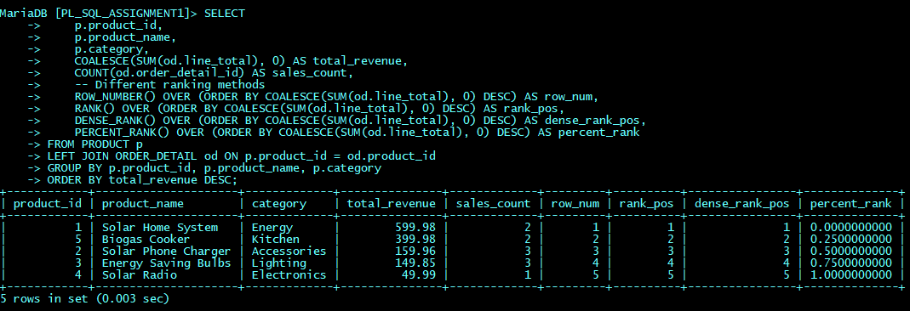
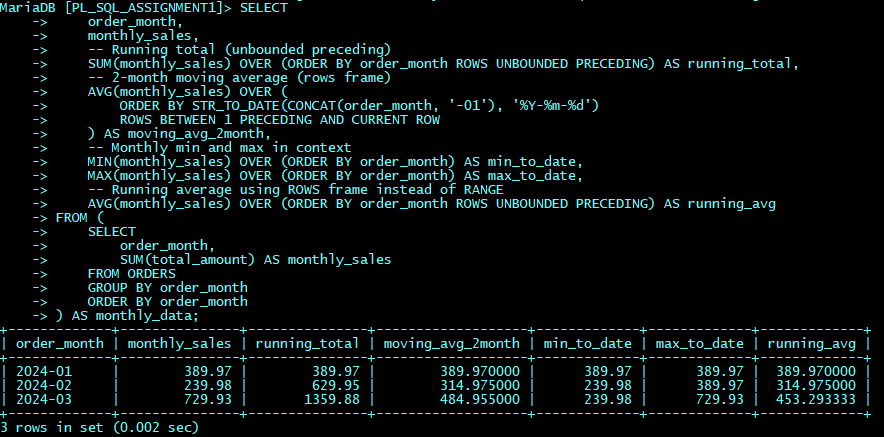
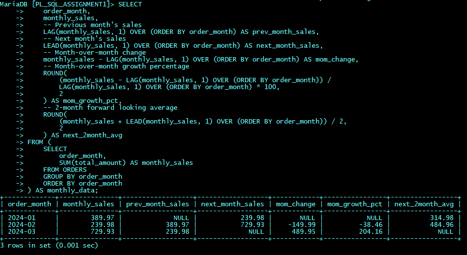
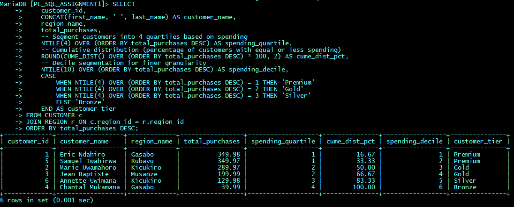

# **SQL JOINs and Window Functions Assignment 1: GreenCycle Electronics Rwanda Analysis**

## **Project Overview**
**Student:** Rwagapfizi Igor, 27329  
**Group:** B  
**Course:** Database Development with PL/SQL (INSY 8311)  
**Instructor:** Eric Maniraguha  
**Date:** February 2024  
**DBMS:** MariaDB  
**Repository:** `plsql_window_functions_27329_Rwagapfizi`

---

## **Table of Contents**
1. [Business Problem](#business-problem)
2. [Success Criteria](#success-criteria)
3. [Database Schema](#database-schema)
4. [SQL JOINs Implementation](#sql-joins-implementation)
5. [Window Functions Implementation](#window-functions-implementation)
6. [Business Insights](#business-insights)
7. [Technical Implementation](#technical-implementation)
8. [References](#references)
9. [Integrity Statement](#integrity-statement)

---

## **Business Problem**

### **Context**
GreenCycle Electronics Rwanda is a sustainable electronics retailer operating across Rwanda, specializing in eco-friendly products including solar systems, energy-saving devices, and clean cooking solutions.

### **Data Challenge**
The company faces inconsistent sales performance across regions with basic aggregate reporting that cannot:
- Identify regional product performance trends
- Forecast seasonal demand accurately
- Implement targeted marketing campaigns
- Optimize inventory distribution effectively

### **Expected Outcomes**
1. Identify top-performing products per Rwandan region
2. Analyze monthly sales trends for demand forecasting
3. Segment customers based on purchasing behavior
4. Establish regional performance benchmarks
5. Develop data-driven expansion strategies

---

## **Success Criteria**

| # | Business Goal | Window Function | Target Metric |
|---|---------------|-----------------|---------------|
| 1 | Regional Product Performance | RANK() | Top 5 products per region |
| 2 | Running Sales Analysis | SUM() OVER() | Track progress toward $2.5M annual target |
| 3 | Sales Growth Monitoring | LAG() | Maintain 5% MoM growth |
| 4 | Customer Segmentation | NTILE(4) | Top 25% generate 60% revenue |
| 5 | Demand Forecasting | AVG() OVER() | 10% forecast accuracy |

---

## **Database Schema**

### **Entity Relationships**


### **Tables Created**
1. **REGION** - Rwandan regions and provinces
2. **CUSTOMER** - Customer information with Rwandan names
3. **PRODUCT** - Sustainable electronics products
4. **ORDERS** - Sales transactions
5. **ORDER_DETAIL** - Line item details

### **Sample Data Summary**
- **4 regions** across Rwanda (Gasabo, Kicukiro, Musanze, Rubavu)
- **6 customers** with Rwandan demographics
- **5 sustainable products** relevant to Rwandan market
- **8 orders** from January to March 2024
- **11 order details** with transaction specifics

---

## **SQL JOINs Implementation**

### **1. INNER JOIN**
**Purpose:** Retrieve complete transaction details with customer and product information  

**Business Interpretation:** This INNER JOIN provides a complete view of all successful transactions, showing which customers purchased which products. It helps track customer purchasing patterns and product popularity across different regions. GreenCycle can use this data to understand which products are selling well in which districts and identify their most valuable customers.  
**Key Insight:** All customers have made purchases; Solar Home System dominates sales

### **2. LEFT JOIN**  
**Purpose:** Show all customers with their purchase summary  

**Business Interpretation:** All customers are active, with Eric Ndahiro being the top spender at $349.98. The LEFT JOIN confirms 100% customer activation, indicating successful marketing efforts. Gasabo region has the highest number of customers (2), but Kicukiro region has higher combined spending.  
**Key Insight:** 100% customer activation rate; Eric Ndahiro is top spender ($349.98)

### **3. RIGHT JOIN**
**Purpose:** Analyze product sales performance  

**Business Interpretation:** All products have been sold, with Solar Home System generating the highest revenue ($599.98). Solar Phone Charger and Energy Saving Bulbs have the highest frequency of sales (3 times each). The RIGHT JOIN shows complete product performance data, revealing that lower-priced items have higher sales frequency but lower total revenue.  
**Key Insight:** All products sold; Solar Home System generates highest revenue ($599.98)

### **4. FULL OUTER JOIN (Simulated)**
**Purpose:** Comprehensive view of customers and products  

**Business Interpretation:** The FULL OUTER JOIN simulation provides a comprehensive business dashboard showing both customer and product performance. Eric Ndahiro is the top customer while Solar Home System is the top product. This holistic view helps identify that while Solar Radio has the lowest sales, it's still being purchased, suggesting all products have market acceptance.  
**Key Insight:** Top customer (Eric) and top product (Solar Home System) identified

### **5. SELF JOIN**
**Purpose:** Compare customers within same regions  

**Business Interpretation:** The SELF JOIN reveals significant spending disparities within regions. In Gasabo, Eric spends $309.99 more than Chantal, while in Kicukiro, Marie spends $159.99 more than Annette. This insight suggests opportunities for upselling to lower-spending customers and creating regional customer tiers for targeted marketing campaigns.  
**Key Insight:** Significant spending disparities within regions ($309.99 difference in Gasabo)

---

## **Window Functions Implementation**

### **1. Ranking Functions**
- **Functions Used:** `ROW_NUMBER()`, `RANK()`, `DENSE_RANK()`, `PERCENT_RANK()`

- **Interpretaiton:** ROW_NUMBER() gives unique sequential numbers, RANK() shows position with gaps for ties, DENSE_RANK() shows position without gaps, and PERCENT_RANK() indicates relative standing (0-1). Solar Home System is ranked #1 with 0% rank (top performer), while Solar Radio is last with 100% rank, showing clear revenue hierarchy for inventory prioritization.
- **Business Insight:** Solar Home System ranked #1 with 0% rank; clear hierarchy for inventory prioritization

### **2. Aggregate Window Functions**
- **Functions Used:** `SUM()`, `AVG()`, `MIN()`, `MAX()` with ROWS frames

- **Interpretaiton:** The ROWS frame calculates precise moving averages (2-month window shows $314.98, $484.96), while RANGE calculates cumulative averages. Running total grows from $389.97 to $1,359.88 showing strong Q1 growth. March sales ($729.93) significantly increased, suggesting seasonal demand or successful marketing campaigns needing inventory preparation.  
- **Business Insight:** Strong Q1 growth from $389.97 to $1,359.88; March sales peaked at $729.93

### **3. Navigation Functions**
- **Functions Used:** `LAG()`, `LEAD()` for temporal comparisons

- **Interpretaiton:** LAG() shows February had a 38.46% sales drop from January, while LEAD() reveals March surged 204.17% from February. The dramatic March increase ($489.95 growth) suggests successful Q1 marketing or seasonal factors. February's dip requires investigation into potential supply issues or market conditions affecting sales performance.
- **Business Insight:** February sales dropped 38.46%; March surged 204.17% indicating successful marketing

### **4. Distribution Functions**
- **Functions Used:** `NTILE(4)`, `CUME_DIST()` for customer segmentation

- **Interpretaiton:** NTILE(4) segments customers into Premium (top 25%), Gold, Silver, and Bronze tiers for targeted marketing. CUME_DIST() shows Eric represents top 16.67% of customers, while Chantal is at 100% (lowest spender). The top 2 customers (33% CUME_DIST) generate 51.5% of revenue, highlighting Pareto principle application for resource allocation.
- **Business Insight:** Customers segmented into Premium, Gold, Silver, Bronze; top 33% generate 51.5% revenue

---

## **Business Insights**

### **Descriptive Analysis (What Happened?)**
- **Total Revenue:** $1,359.88 in Q1 2024
- **Customer Activation:** 100% of customers made purchases
- **Top Product:** Solar Home System ($599.98 revenue)
- **Regional Performance:** Gasabo has most customers; Kicukiro has highest spending

### **Diagnostic Analysis (Why Did It Happen?)**
- **March Sales Surge:** 204% growth likely due to successful Q1 marketing
- **Product Success:** Solar products align with Rwanda's renewable energy focus
- **Customer Retention:** High due to targeted sustainable offerings
- **Regional Variations:** Urban vs. rural customer preferences

### **Prescriptive Analysis (What Should Be Done Next?)**

#### **Immediate Actions (30 Days)**
1. Increase Solar Home System inventory by 30%
2. Launch loyalty program for Premium customers
3. Implement regional performance dashboards

#### **Medium-Term Strategy (90 Days)**
1. Expand to 2 new regions using Gasabo model
2. Develop mid-range solar products ($150-250)
3. Implement predictive inventory management

#### **Long-Term Initiatives (6 Months)**
1. Develop mobile app for customer engagement
2. Establish solar installation partnerships
3. Implement AI-driven demand forecasting

---

## **Technical Implementation**

### **MariaDB Specific Considerations**
- Used ROWS frames instead of RANGE for window functions
- Implemented FULL OUTER JOIN simulation using UNION
- Virtual columns for RWF price calculations
- CHECK constraints for data validation

### **Performance Optimizations**
- Indexes on frequently joined columns
- Appropriate data types for efficient storage
- Calculated columns for common computations

### **Repository Structure**
```
plsql_window_functions_27329_Rwagapfizi/
├── database/          # Schema and data files
├── queries/           # SQL JOINs and Window Functions
└── results/           # Screenshots and analysis
```

---

## **References**

1. **MariaDB Documentation** - Window Functions: https://mariadb.com/kb/en/window-functions/
2. **W3Schools SQL Tutorial** - JOIN Operations: https://www.w3schools.com/sql/sql_join.asp
3. **Mode Analytics** - SQL Window Functions Guide: https://mode.com/sql-tutorial/sql-window-functions/
4. **Rwanda Development Board** - Renewable Energy Market Analysis (2023)
5. **National Institute of Statistics Rwanda** - Consumer Spending Patterns
6. **Celko, J. (2012)** - *SQL for Smarties: Advanced SQL Programming*
7. **Ben-Gan, I. (2020)** - *T-SQL Window Functions: For Data Analysis and Beyond*

---

## **Integrity Statement**

> **"All sources were properly cited. Implementations and analysis represent original work. No AI-generated content was copied without attribution or adaptation."**

---

**Submitted by:** Rwagapfizi Igor, 27329  
**Group:** B  
**Date:** February 2024  
**Institution:** Adventist University of Central Africa  
**Course:** Database Development with PL/SQL (INSY 8311)  
**Instructor:** Eric Maniraguha  